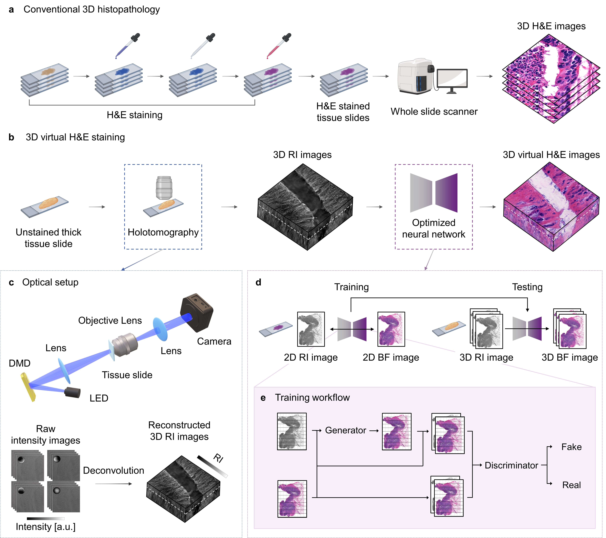

# 3D Virtual_staining_HE


This repository contains codes and datasets necessary for testing the virtual H&E staining of label-free holotomography images of tissue slides.

## Download datasets and model before testing
Pre-trained model (gastric dataset) : [link](https://drive.google.com/file/d/1rB6pM1pJmdayTqAzPdaV7xmjihmPQHZm/view?usp=sharing) <br>
Example testing dataset (gastric dataset): [link](https://drive.google.com/drive/folders/19YCDilCcSdIkYjsbzDsblbmHX_Y3whN0?usp=drive_link)

## Installation
```shell
conda env create -f environment.yml
``` 

## Set the directories

```shell

dataset                
 ├──  test.yaml
 ├──  test     
 |      ├── 001.h5     
 |      ├── ...
 |      └── xxx.h5
 └──

model-gastric                
 ├──  ckpt     
 |      └── model_gastric.pth
 └──

codes
 └── codes downloaded from this repository

```

## Use appropriate path for the following parameters
In the main.py, 

``` shell

--data_dir = 'xxx/dataset'
--ckpt_dir = 'xxx/model-gastric/ckpt'
--result_dir = 'where you want to save the results'

```


## Run the code

```shell

python main.py --network scnas --mode test --batch_size 1

```
The training and testing were all performed with the options of --batch_size 1 and --network scnas

## Expected results
Expected results for the provided dataset : [link](https://drive.google.com/drive/folders/1B7I-rK08SQtLryqWlFhLTurYagtW-dTU?usp=drive_link)

## License
This project is open-sourced under the MIT license.


